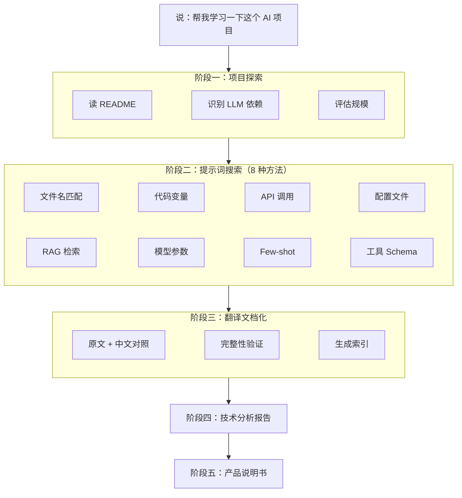

<p align="center">
  <h1 align="center">learn-ai-projects</h1>
  <p align="center">
    <strong>AI 项目深度学习分析器</strong><br>
    一句话触发全量扫描：自动提取开源 AI 项目中散落各处的提示词，翻译成中文，梳理 LLM 调用架构，生成技术分析报告和产品说明书。
  </p>
  <p align="center">
    
    
    
  </p>
  <p align="center">
    <a href="README_EN.md">English</a>
  </p>
</p>

---

## 它解决什么问题

想学习一个开源 AI 项目，打开一看：提示词散落在十几个文件里——变量定义、配置文件、API 调用参数、独立模板文件——翻了半天也不确定找全了没。更别说理解整体架构、给团队写中文文档了。

所以我做了 learn-ai-projects：**一句话下去，8 种方法并行搜索，自动提取全部提示词并翻译成中文，生成技术报告和产品说明书。** 再也不用自己一个个翻了。

## Before / After

| | 手动分析 AI 项目 | learn-ai-projects |
|---|:---:|:---:|
| **找提示词** | 逐文件翻，靠关键词搜索，容易遗漏 | 8 种搜索方法全量扫描，不漏 |
| **理解架构** | 自己画图、记笔记 | 自动生成 Mermaid 架构图 + 调用链分析 |
| **中文文档** | 手动翻译，格式容易乱 | 原文 + 中文对照，保留格式和占位符 |
| **团队分享** | 写 Wiki 或 PPT | 直接交付技术报告 + 产品说明书 |

## 一句话怎么用

```
帮我学习一下这个 AI 项目
```

Skill 自动完成五个阶段：

1. **探索** — 识别项目结构、LLM 依赖库、评估规模
2. **搜索** — 8 种方法系统搜索所有提示词和工具定义，生成主清单（MANIFEST）
3. **翻译** — 为每个提示词生成中英对照文档，验证完整性后生成索引
4. **报告** — 8 章技术分析报告（架构图、调用链、模型参数、Prompt 工程分析等）
5. **说明书** — 12 章产品说明书，面向非技术人员，通俗易懂

## 输出示例

```
ai_analysis/
├── translated_prompts/
│   ├── MANIFEST.md                    ← 提示词主清单（逐项列出每个提示词）
│   ├── INDEX.md                       ← 翻译文档索引
│   ├── configs_system_prompt_zh.md    ← 系统提示词（原文 + 中文翻译）
│   ├── agent_planner_prompt_zh.md     ← Agent 规划提示词
│   └── ...                            ← 更多翻译文档
├── AI_MODEL_USAGE_ANALYSIS.md         ← 技术分析报告（含 Mermaid 架构图）
├── PRODUCT_GUIDE.md                   ← 产品说明书（含术语解释）
└── ERRORS.md                          ← 异常日志（仅在有异常时创建）
```

## 架构



## 8 种搜索方法

| 方法 | 搜索目标 | 示例 |
|------|---------|------|
| 文件名匹配 | `.md` / `.txt` / `.jinja2` 模板文件 | `prompts/system.md` |
| 代码变量 | `system_prompt = """..."""` 等内联定义 | Python / JS / TS 变量 |
| API 调用 | `messages=[{"role": "system", ...}]` | OpenAI / Anthropic SDK |
| 配置文件 | YAML / JSON / TOML 中的提示词字段 | `config.yaml` |
| RAG 检索 | 检索增强相关的提示词模板 | `retrieval_prompt` |
| 模型参数 | temperature / top_p / max_tokens 等 | 调用参数分析 |
| Few-shot | 示例输入输出对 | `examples = [...]` |
| 工具 Schema | function calling / tool_use 定义 | `tools=[{...}]` |

## 大型项目支持

| 项目规模 | 提示词数量 | 执行策略 |
|---------|-----------|---------|
| 小型 | ≤ 30 | 顺序执行，单文件 MANIFEST |
| 中型 | 31 - 100 | 分组并行，子代理翻译 |
| 大型 | 101 - 300 | 多波调度，分模块 MANIFEST |
| 超大型 | 300+ | 核心目录优先，极致压缩上下文 |

支持断点续传：长时间分析中断后，检测已有产出文件，从断点继续而非从头开始。

## 触发方式

```
帮我学习一下这个项目
看看这个项目怎么调 GPT 的
这个 agent 框架的 prompt 在哪
帮我整理下这个 AI 项目
研究一下这个项目怎么用的大模型
给这个 AI 项目出个产品说明书
analyze this LLM project
extract all prompts from this repo
how does this project use Claude/OpenAI
```

## 安装

### 前置条件

- 支持 SKILL.md 规范的 Agent 应用（[Claude Code](https://claude.com/claude-code) / [Trae](https://www.trae.cn/) / [Cline](https://cline.bot/) 等）

### 安装方式

**Claude Code**

```bash
# 方式一：放在项目目录（自动发现）
git clone https://github.com/autumnseasonism/learn-ai-projects-skills.git

# 方式二：放在全局 skills 目录
git clone https://github.com/autumnseasonism/learn-ai-projects-skills.git ~/.claude/skills/learn-ai-projects
```

**Trae / Cline / 其他 Agent**

将目录放到对应 Agent 的 skills 扫描路径下，具体路径请参考各 Agent 的文档。

## 技术特点

- **零代码，纯 Skill** — 完全通过 `SKILL.md` + references + templates 实现，无外部脚本依赖
- **渐进式加载** — SKILL.md 保持精简（~150 行），详细规范按需从 reference/ 加载，节省上下文
- **8 种搜索方法** — 覆盖文件名、代码变量、API 调用、配置文件等所有维度，确保不遗漏
- **子代理并行** — 大型项目自动分组并行翻译，最多 6 个子代理同时工作
- **验证门控** — 翻译完成后比对 MANIFEST 与实际文件，100% 覆盖才生成索引
- **多 Agent 兼容** — Claude Code / Trae / Cline 等支持 SKILL.md 的 Agent 均可使用

## 文件结构

```
learn-ai-projects-skills/
├── SKILL.md                       # 主技能文件（五阶段流程、执行原则）
├── reference/
│   ├── verification.md            # MANIFEST 格式与 6 步验证流程
│   ├── scale_strategies.md        # 4 级规模策略（小/中/大/超大）
│   └── fault_handling.md          # 故障分类与降级交付规则
├── templates/
│   ├── search_patterns.md         # 8 种搜索方法与正则模式
│   ├── doc_template.md            # 翻译文档模板
│   ├── report_template.md         # 分析报告模板（8 章）
│   └── guide_template.md          # 产品说明书模板（12 章）
├── LICENSE                        # MIT License
├── README.md                      # 中文文档
└── README_EN.md                   # English documentation
```

## 实测数据

在 3 个不同规模的开源 AI 项目上测试，8 项断言全部通过：

| 项目 | Python 文件数 | 发现提示词 | 生成翻译文档 | 断言通过率 |
|------|-------------|-----------|-------------|-----------|
| [gpt-researcher](https://github.com/assafelovic/gpt-researcher) | ~200 | 44 | 44 | 8/8 (100%) |
| [browser-use](https://github.com/browser-use/browser-use) | ~100 | 23 | 23 | 8/8 (100%) |
| [mem0](https://github.com/mem0ai/mem0) | 432 | 11 | 11 | 8/8 (100%) |

## 致谢

本项目基于 [@comeonzhj](https://github.com/comeonzhj) 的 [howPrompt](https://github.com/comeonzhj/howPrompt) 改造而来。howPrompt 是一个驱动 Claude Code 拆解开源项目的提示词，为本项目提供了核心思路和灵感。感谢原作者的开源贡献！

## 许可证

[MIT](LICENSE)
