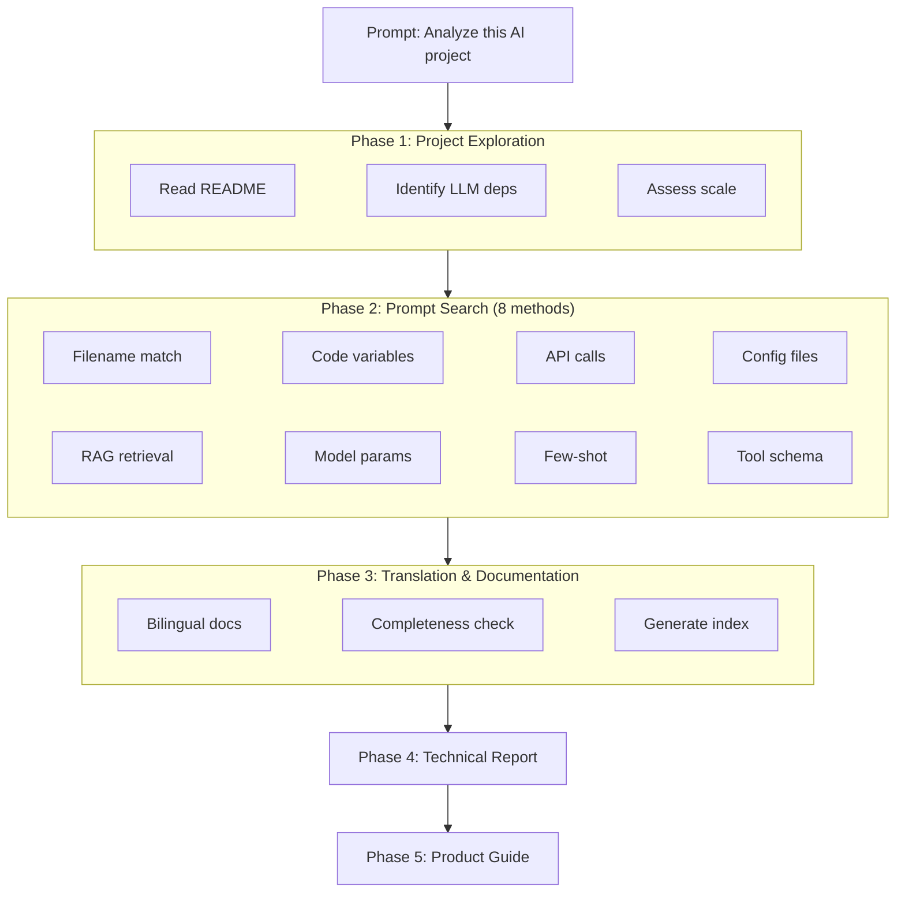

<p align="center">
  <h1 align="center">learn-ai-projects</h1>
  <p align="center">
    <strong>AI Project Deep Analysis Skill</strong><br>
    One prompt to scan it all: automatically extract prompts scattered across open-source AI projects, translate to Chinese, map LLM call architecture, and generate technical reports and product guides.
  </p>
  <p align="center">
    
    
    
  </p>
  <p align="center">
    <a href="README.md">中文</a>
  </p>
</p>

---

## What Problem Does It Solve

You want to learn from an open-source AI project, but prompts are scattered across dozens of files — variable definitions, config files, API call parameters, standalone templates. After digging through for half an hour, you're still not sure you found them all. Let alone understanding the architecture or writing documentation for your team.

learn-ai-projects solves this: **one prompt triggers 8 search methods in parallel, automatically extracts all prompts and translates them to Chinese, then generates a technical report and product guide.**

## Before / After

| | Manual Analysis | learn-ai-projects |
|---|:---:|:---:|
| **Find prompts** | File-by-file search, easy to miss | 8 search methods, full coverage |
| **Understand architecture** | Draw diagrams manually | Auto-generated Mermaid diagrams + call chain analysis |
| **Chinese docs** | Manual translation, formatting breaks | Side-by-side original + Chinese, format preserved |
| **Team sharing** | Write Wiki or slides | Ready-to-deliver technical report + product guide |

## Quick Start

```
Analyze this AI project for me
```

The skill automatically runs through five phases:

1. **Explore** — Identify project structure, LLM dependencies, assess scale
2. **Search** — 8 methods to systematically find all prompts and tool definitions, generate manifest (MANIFEST)
3. **Translate** — Create bilingual docs for each prompt, verify completeness, generate index
4. **Report** — 8-chapter technical analysis (architecture diagrams, call chains, model parameters, prompt engineering analysis)
5. **Guide** — 12-chapter product guide for non-technical readers

## Output Structure

```
ai_analysis/
├── translated_prompts/
│   ├── MANIFEST.md                    ← Prompt manifest (every prompt listed)
│   ├── INDEX.md                       ← Translation index
│   ├── configs_system_prompt_zh.md    ← System prompt (original + Chinese)
│   └── ...                            ← More translation docs
├── AI_MODEL_USAGE_ANALYSIS.md         ← Technical report (with Mermaid diagrams)
├── PRODUCT_GUIDE.md                   ← Product guide (with glossary)
└── ERRORS.md                          ← Error log (created only if errors occur)
```

## Architecture



## Large Project Support

| Scale | Prompt Count | Strategy |
|-------|-------------|----------|
| Small | ≤ 30 | Sequential, single MANIFEST |
| Medium | 31 - 100 | Grouped parallel, sub-agent translation |
| Large | 101 - 300 | Wave scheduling, modular MANIFEST |
| XL | 300+ | Core directories first, aggressive context saving |

Supports checkpoint resume: if analysis is interrupted, detects existing output files and continues from where it left off.

## Installation

### Prerequisites

- An Agent app supporting the SKILL.md spec ([Claude Code](https://claude.com/claude-code) / [Trae](https://www.trae.cn/) / [Cline](https://cline.bot/) etc.)

### Install

**Claude Code**

```bash
# Option 1: Project-level (auto-discovered)
git clone https://github.com/autumnseasonism/learn-ai-projects-skills.git

# Option 2: Global skills directory
git clone https://github.com/autumnseasonism/learn-ai-projects-skills.git ~/.claude/skills/learn-ai-projects
```

**Trae / Cline / Other Agents**

Place the directory in your Agent's skills scan path. Refer to your Agent's documentation for the exact path.

## Technical Highlights

- **Zero code, pure Skill** — Implemented entirely via `SKILL.md` + references + templates, no external scripts
- **Progressive loading** — SKILL.md stays lean (~150 lines), detailed specs loaded on-demand from reference/
- **8 search methods** — Covers filenames, code variables, API calls, configs, and more
- **Sub-agent parallelism** — Large projects auto-grouped for parallel translation, up to 6 concurrent sub-agents
- **Verification gate** — Post-translation MANIFEST vs. file comparison, 100% coverage required before index generation
- **Multi-Agent compatible** — Works with Claude Code / Trae / Cline and any Agent supporting SKILL.md

## File Structure

```
learn-ai-projects-skills/
├── SKILL.md                       # Main skill file (5-phase workflow, execution principles)
├── reference/
│   ├── verification.md            # MANIFEST format & 6-step verification
│   ├── scale_strategies.md        # 4-tier scale strategies (S/M/L/XL)
│   └── fault_handling.md          # Fault classification & degraded delivery rules
├── templates/
│   ├── search_patterns.md         # 8 search methods with regex patterns
│   ├── doc_template.md            # Translation document template
│   ├── report_template.md         # Analysis report template (8 chapters)
│   └── guide_template.md          # Product guide template (12 chapters)
├── LICENSE                        # MIT License
├── README.md                      # 中文文档
└── README_EN.md                   # English documentation
```

## Test Results

Tested on 3 open-source AI projects of varying scale, all 8 assertions passed:

| Project | Python Files | Prompts Found | Translation Docs | Assertion Pass Rate |
|---------|-------------|--------------|-----------------|-------------------|
| [gpt-researcher](https://github.com/assafelovic/gpt-researcher) | ~200 | 44 | 44 | 8/8 (100%) |
| [browser-use](https://github.com/browser-use/browser-use) | ~100 | 23 | 23 | 8/8 (100%) |
| [mem0](https://github.com/mem0ai/mem0) | 432 | 11 | 11 | 8/8 (100%) |

## Acknowledgments

This project is inspired by and built upon [howPrompt](https://github.com/comeonzhj/howPrompt) by [@comeonzhj](https://github.com/comeonzhj) — a prompt that drives Claude Code to analyze open-source projects. Thanks for the great work!

## License

[MIT](LICENSE)
