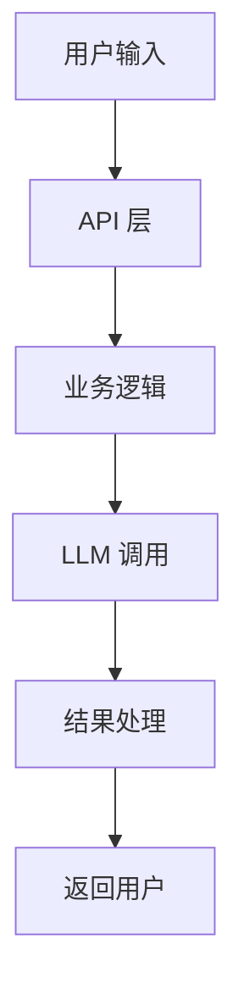
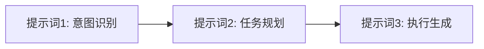

# 分析报告模板

第四阶段使用的报告模板，输出到 `ai_analysis/AI_MODEL_USAGE_ANALYSIS.md`。

> **写作原则**：报告面向有技术背景的读者（开发者、架构师），内容要准确、有深度。所有结论必须有代码位置支撑，不要凭空推测。如果某个章节在项目中不适用（如没有 RAG、没有多 Agent），明确说"该项目未涉及"而不是跳过整个章节。

## 第 1 章：项目概述

- 项目名称
- 项目描述（基于 README 的简要描述）
- 主要功能
- 技术栈
- LLM 相关依赖及版本

## 第 2 章：项目架构与数据流

> 本章聚焦**全局视角**——各模块如何协作、数据如何在系统中流转。

用 Mermaid 绘制两种图：

**模块级架构图**：展示项目各组件（用户输入、前端、后端、LLM 服务、数据库、外部 API 等）之间的关系。示例骨架：



**单次请求时序图**：展示一次典型用户请求从输入到输出的完整链路，标注每一步涉及的提示词和工具调用。

> 图中的节点名称要用项目中实际的模块/文件名，而不是泛化的"业务逻辑"之类的抽象标签。

## 第 3 章：提示词分类统计

| 类别 | 数量 | 用途说明 |
|------|------|----------|
| 系统提示词 | X | ... |
| 用户交互提示词 | X | ... |
| 任务处理提示词 | X | ... |
| Few-shot 示例 | X | ... |
| ... | ... | ... |

## 第 4 章：大模型应用场景分析

> 本章聚焦**每个具体调用点的细节**。

### 场景 1: [场景名称]
- 触发条件:
- 使用的提示词: [链接到翻译文档]
- 代码位置: `path/to/file.py:line`
- 输入输出:
- 模型参数: model=xxx, temperature=xxx, max_tokens=xxx
- 作用:

### 提示词链路图

如果存在多个提示词串联调用（前一个的输出作为后一个的输入），绘制提示词之间的依赖链路：



## 第 5 章：工具清单

| 工具名称 | 描述（中文） | 调用场景 | 代码位置 |
|---------|-------------|---------|---------|
| ... | ... | ... | ... |

每个工具的详细参数 Schema 在表格下方用独立代码块展示：

**工具名称: xxx**

```json
{
  "name": "...",
  "description": "...",
  "parameters": { ... }
}
```

> 如果项目没有定义工具，写明"该项目未定义工具 Schema"。

## 第 6 章：模型调用参数汇总

| 调用位置 | 模型 | temperature | max_tokens | 其他参数 | 用途 |
|---------|------|-------------|------------|---------|------|
| `src/agent.py:42` | gpt-4 | 0.7 | 2000 | stream=True | 对话生成 |
| ... | ... | ... | ... | ... | ... |

> 如果参数是从配置文件或环境变量读取的，标注来源（如"来自 config.yaml"）而非写死数值。

## 第 7 章：上下文工程

- 如果项目为大模型 Agent 相关，根据提示词、大模型 API 调用和上下文构建逻辑，拆解项目是如何构造循环的
  - Tips：Agent 是指模型根据任务和数据自主多轮交互，而不是一次性完成任务。LLM 作为项目的独立决策者，负责制定计划、决定调用哪个工具、根据工具返回决定进行下一步还是结束，即 "LLM makes the loop、LLM in the loop、LLM ends the loop"

- **多 Agent 协作**：如果项目使用了多 Agent 框架（CrewAI、AutoGen、LangGraph 等），分析：
  - 各 Agent 的角色定义和职责划分
  - Agent 之间的通信机制（顺序执行、并行、层级、对话式）
  - 任务分配和结果汇总的逻辑
  - 用图示展示 Agent 协作拓扑

- 如果项目为大模型嵌入型，或大模型作为业务流程中的"工具"，根据每个调用大模型环节前序和后续流程，分析如何为大模型提供上下文、引导模型输出了什么（将数据结构化、生产了某种数据，等等）

- **RAG 流程分析**（如适用）：
  - 文档切分策略（chunk size、overlap）
  - 向量化模型和存储方案
  - 检索策略（相似度阈值、top-k、重排序）
  - 检索结果如何注入提示词

## 第 8 章：关键发现与总结

- 项目共发现 X 个提示词、X 个工具定义
- 核心使用模式：[Agent / 嵌入型 / RAG / 混合]
- 提示词工程特点：[是否使用 few-shot、是否有 chain-of-thought、是否动态拼接等]
- 提示词中是否存在外部平台托管（如 Langfuse、PromptLayer 等，代码中只有 `prompt_id` 引用而无内容）——如有标注为 [内容托管于外部平台]
- **亮点**：项目在提示词工程上做得好的地方
- **改进空间**：可以优化的地方（如缺少 system prompt、temperature 设置不合理等）——仅在明显时提出
